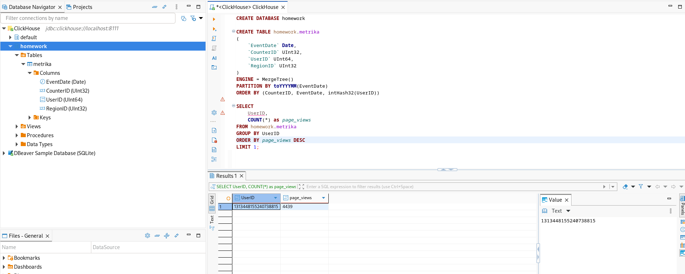

# Домашнее задание к занятию "Clickhouse" - Барышков Михаил

## Задание


- Создайте базу homework

```sql
CREATE DATABASE homework
``` 

- Создаём таблицу metrika

```sql 
CREATE TABLE homework.metrika
(
    `EventDate` Date,
    `CounterID` UInt32,
    `UserID` UInt64,
    `RegionID` UInt32
)
ENGINE = MergeTree()
PARTITION BY toYYYYMM(EventDate)
ORDER BY (CounterID, EventDate, intHash32(UserID))
```

- Заливаем данные в таблицу

```bash
cat metrika_sample.tsv | clickhouse-client --database homework --query "INSERT INTO metrika FORMAT TSV"
```

- Посчитайте какой пользователь UserID сделал больше всего просмотров страниц?


## Решение

```sql
SELECT 
    UserID,
    COUNT(*) as page_views
FROM homework.metrika
GROUP BY UserID
ORDER BY page_views DESC
LIMIT 1;
```

### Результат

UserID|page_views|
:-:|:-:
1313448155240738815|4439|


